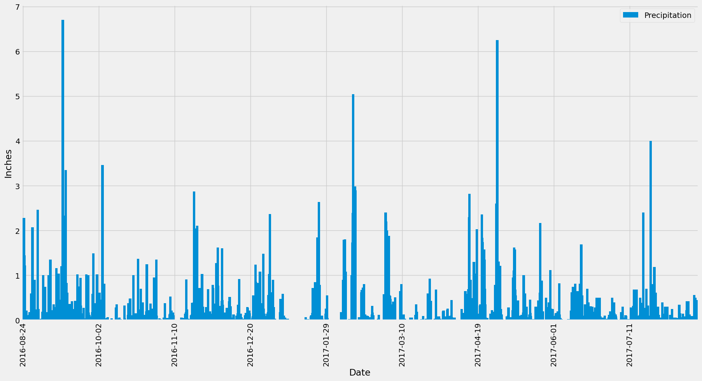
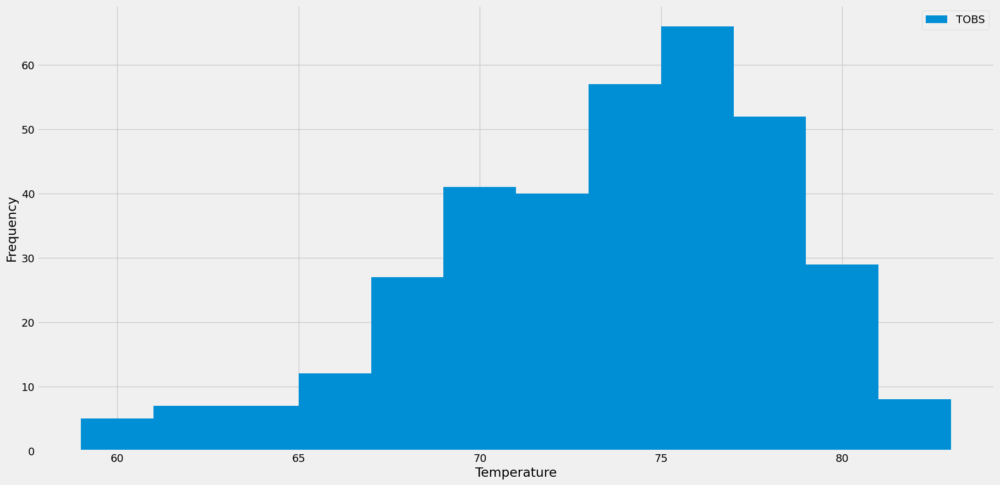

# SQLAlchemy Challenge

## Overview
In this challenge, I conducted a climate analysis in Hawaii, examining both precipitation and temperature data cross nine stations in the area. 

### Part 1: Analyzing and Exploring the Climate Data
I used Python, SQLAlchemy ORM queries, Pandas, and Matplotlib to query and visualize precipitation and temperature data over the past year.
The chart below shows the precipitation levels over the past year, from 2016/08/24 to 2017/08/23. 

The following chart displays the temperature data over the past year for the most active station, USC00519281.

### Part 2: Design Your Climate App
Here, I used Python, SQLAlchemy ORM queries, and Flask to create a "Climate App" designed to produce query results in an easy-to-read format. I created the following routes:
1. Home Page: lists all the available routes
2. Precipitation: precipitation data for each station over the last 12 months
3. Station: a list of the stations
4. TOBs: dates and temperature data of the most active station (USC00519281) over the last 12 months
5. Specified Start Date: min, max, and average temperatures for all data starting from the specified date to the end of the dataset
6. Specified Start and End Dates: min, max, and average temperatures for all data between the specified start and end dates